# Battleships Game
 
Battleships is a strategy guessing game that can be played against the computer or between two players. This version will be played against the computer.
 
 
Battleships is accessible to, and can be enjoyable, for all age groups but requires a good strategy to be played well. Anyone who loves a challenege will enjoy this game.
 
 
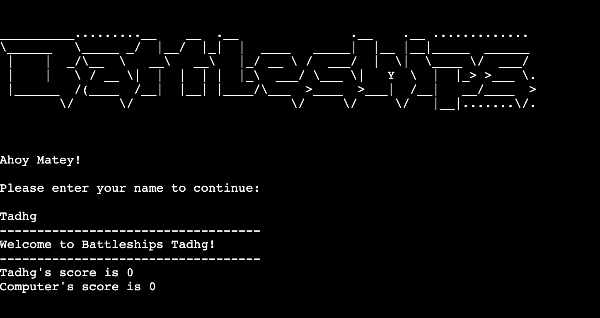
 

This is a welcoming opening for players of Battleships. It personalises the welcome message depending on the name input provided. There is also error handling in case this field is left blank.

## How to play
 
This version of Battleships will be played on two 6x6 grids. One for the player and one for the computer

The aim of the game is to sink all of the opponent's battleships before they sink all of yours

At the start of the game you will be asked to input your name

Then, you will input your co-ordinates (row followed by column) and press enter to check if you have hit one of the computer's ships

This is an unforgiving game so make sure not to choose the same co-ordinates twice or the computer will get a free guess and you'll miss your turn!

Depending on the result, both your board and the computer's board will be updated with the position of your respective guesses

This will repeat until there is a winner!

## Features
 
This game features a computer board and a player board when printed and the player board is unique to the name input provided as opposed to being a generic board name. It makes for a more engaging game experience.
 
 
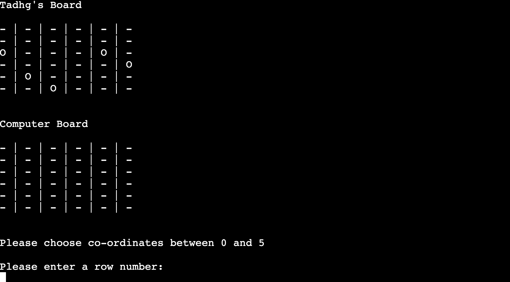
 
 
Once the row and column have been validated, the results of that round of playing are shown. Here is an example of a miss for both player and computer.
 
 
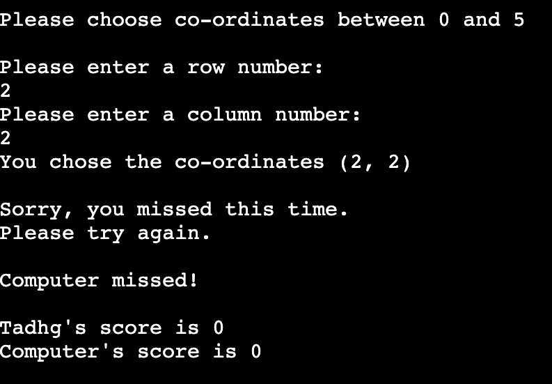
 
 
Here is an example of a player guess when the co-ordinates inputted have been previously selected. You will miss your turn if you make this mistake!
 
 
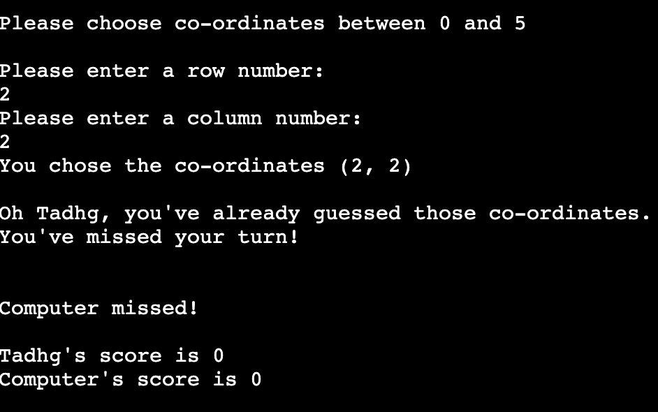
 
 
Through the use of try/except statements and while loops, there is comprehensive error handling for numbers outside the grid size as well as for non-numeric values.
 
 

 
 
This is an example of a computer hit and a player miss. You'll have to try again. Better luck next time!
 
 
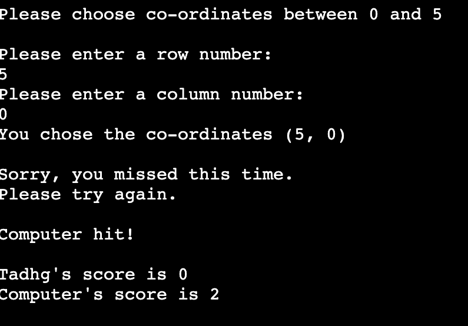
 
 
This time you got lucky! This is an example of a player hit!
 
 
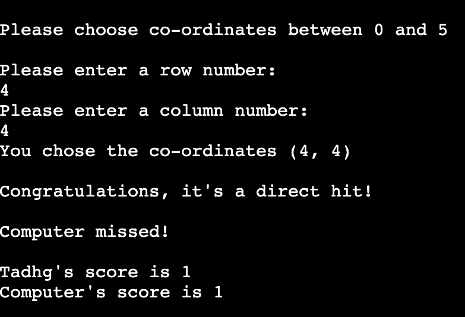
 
 
Here we can see that the player score and computer score is incremented and the board updated to reflect the score.
 
 
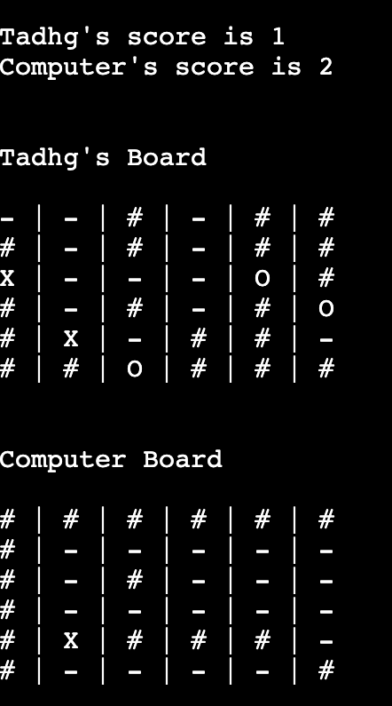
 
 
Once either the player or the computer has hit all 5 ships, the appropriate winning message is displayed and the program is complete.
 
 
Using the Run Program button in the Code Institute mock terminal, we can restart the game.
 
 
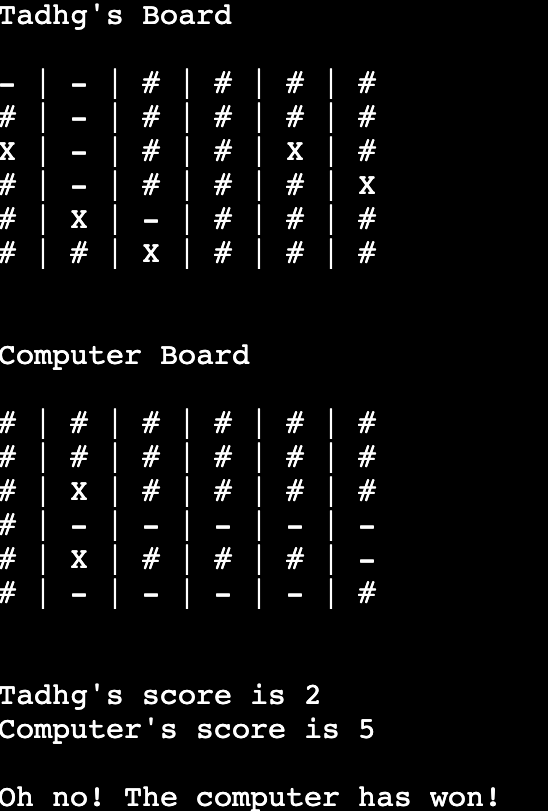
 

### Features Left To Implement

Implement a feature to give the player the option of choosing the position of their ships instead of having them positioned at random.

Allow players to chooose the length of their ships to add more strategy to the game than ships of length 1.

Add the option of choosing a player vs player setup where you can play against your friends instead of playing the computer.

## Technologies

PYTHON

[Github](https://github.com/) was used for version control to store commit history.

[Heroku](https://www.heroku.com/home) was used to deploy our final project.

## Testing
 

### Validator Testing

 

PYTHON: No errors were returned when passing through the official [Pep8](http://pep8online.com/) linter.
 
 

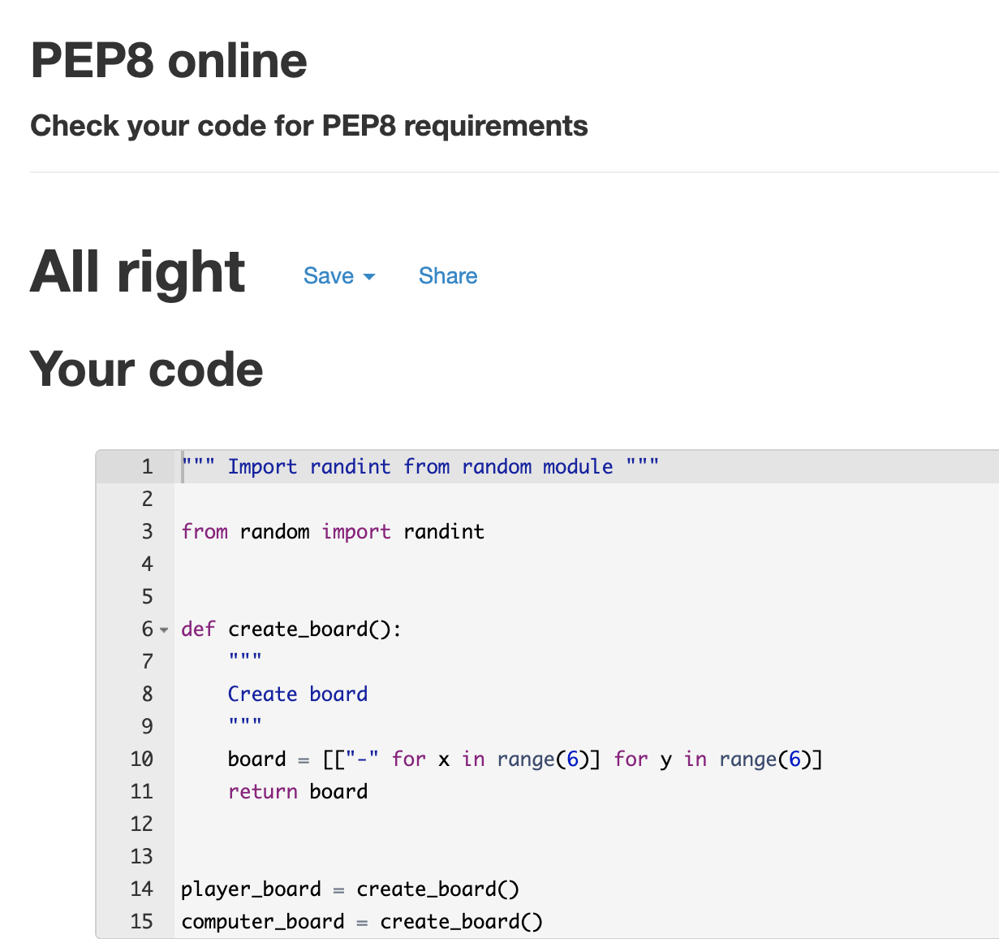

### Testing and debugging code

 
I have used Docstrings throughout my code to identify each function and its purpose.
 
 

Testing has been done using both [PythonTutor](https://pythontutor.com/visualize.html#mode=edit) and print() to verify and debug my code.
 
 

Here I have displayed each function in my code. These are the nuts and bolts of the game and a view of what these functions look like during game play can be found in the features section of this README file. This can assist in a more visual explanation of these functions.
 
 

This is the random module that has been imported for use in generating random numbers for board creation and computer guess.

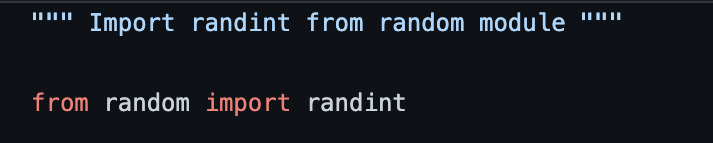

Testing create_board():

Through the use of list comprehension, I have iterated through range(6) for x and y to create a 2D list as my board. This board will then be used to create a visible player board which will store the ship locations of the player, a visible computer board with no ship locations marked, and a hidden computer board to store the ship locations for the computer. This function was tested thoroughly using PythonTutor to work through each step of the board creation. No bugs were found during testing.

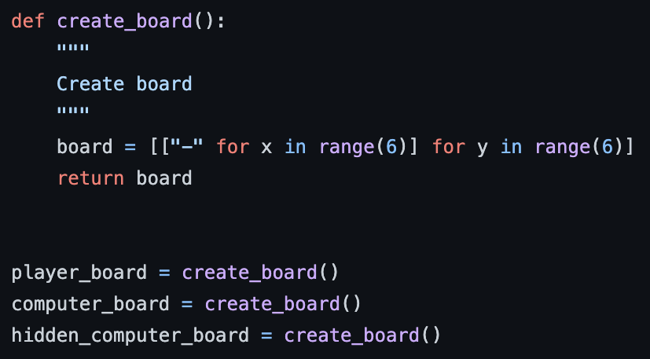

Testing print_board():

This function allows the boards to be printed. It joins a " | " to each row for visual clarity. No bugs were found during testing.

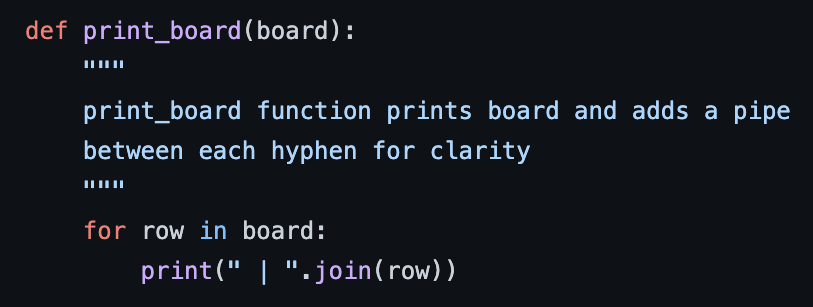

Testing welcome():

This function is straightforward and prints the welcome message and game information to the terminal. No bugs were found during testing.

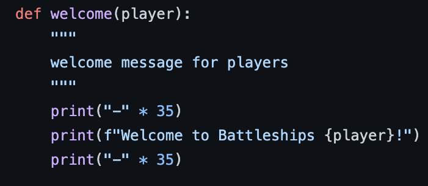

Testing ship_placement():

This function places the ships on the boards by generating a random number. I have used an if statement within a while loop to ensure that a ship cannot be placed on the same co-ordinates and the while loop will be completed when the number of ships is 5. I initially approached creating the ships with a more complicated and unnecessary for loop within a for loop. I struggled to see a way of generating non-repeating random numbers until I changed my approach. No bugs were found but it took me a while to see how I could execute this function successfully. The solution I came up with is simpler and more effective than my initial idea.

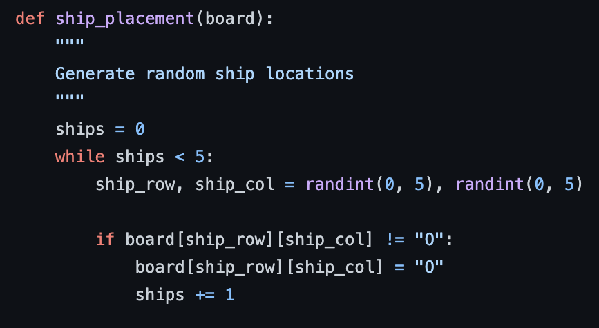

Testing guess_row():

This function prompts the user to input a row number. The input() is wrapped in an int() to ensure that only integers can be accepted. As printed in the main function, a valid row number is between 0 and 5. There is a while loop to ensure that only integers in the range 0 to 5 will be accepted. Until the while loop condition is complete, the user will be asked again to enter a row number. In the case of a non-numeric value being entered, there is an except statement. You will be prompted to enter a valid number and then the guess_row() function will be called again. I initially had the guess_row() function and the guess_col() function as one function but found myself with too many while loops and concluded that the best path forward was to separate them. A bug I encountered before separating the functions was that if a non-numeric value was entered for the row input, it would call the except statement but then exit the loop I had created without asking for column input. I resolved this by creating separate functions and simplifying my code.

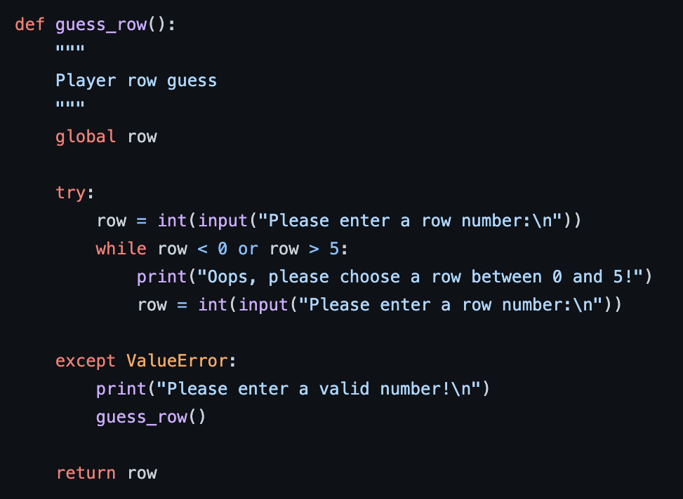

Testing guess_col():

This function is identical to the guess_row function except "col" is the variable instead of "row". This function asks the user for a column input instead of a row input. Bugs and fixes were the same as in the above function.

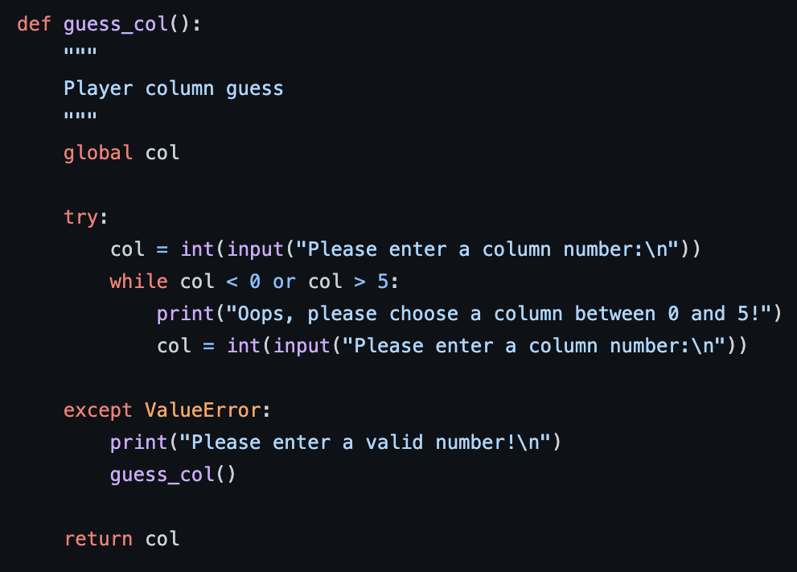

Testing guess_check():

This function defines row and col and calls guess_row() and guess_col() respectively and prints the result. The if/else statement verifies if you have hit a ship, missed a ship, or if you have already guessed those co-ordinates and marks the computer board depending on your guess. If guess_check returns True, the p_score in the main() function is incremented by 1. I tried several different ways of incrementing the score and initially tried to create a separate function. As with some of the previous functions, I was overcomplicating it and when I took a step back I was able to see an alternative. A bug in my previous attempt was that I couldn't get the score to increment at all and then at another point the score was jumping directly to 5 due to an ill-placed for loop. Breaking this problem down into smaller parts as well as solving some of the other functions helped me to fix this problem.

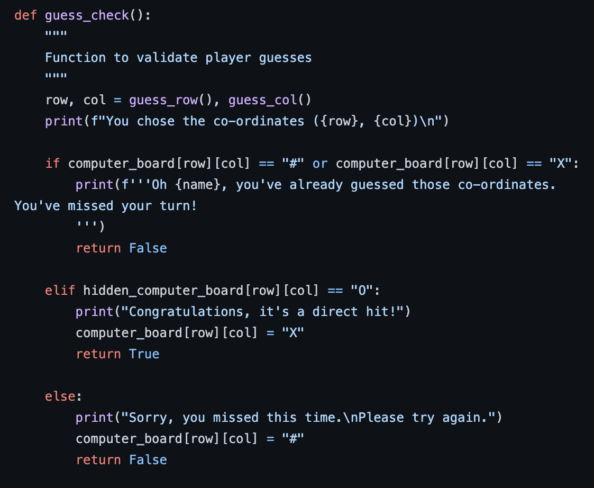

Testing computer_guess():

This function generates a random number to be used as the computer guess. No bugs were found during testing.

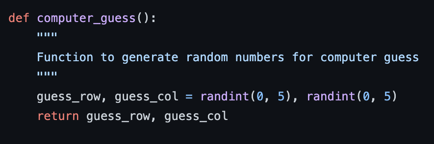

Testing computer_check():

This function is similar to the guess_check function but if the computer has already guessed co-ordinates and missed, or has already hit the co-ordinates, the if statement calls computer_check again until a valid set of co-ordinates has been found. The rest of this function works in the same way as the guess_check function but increments the computer score (c_score in main() function) by 1.

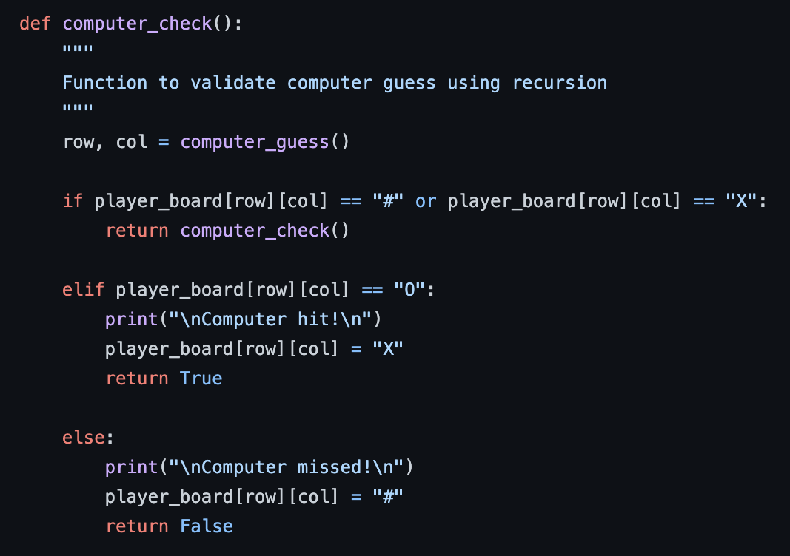

Testing start_game():

This function calls the ship_placement() function to generate the ship locations for the player board and the hidden computer board. This function also prints the initial Battleships message and asks you to input your name. The name input cannot be left blank and this is achieved through the use of a while loop and length of name that must be greater than 0. When the while loop is complete, the welcome() function is called. No bugs were found during testing.

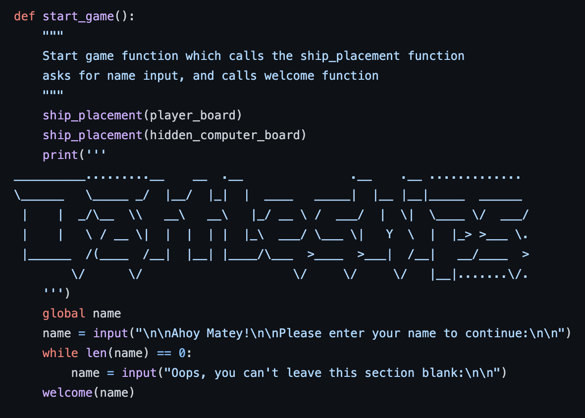

Testing main():

This is the main game function to start the game. The start_game() function is called. Then we define the scores for the player and computer. There is a while loop to take care of scoring and incrementation for the game. By calling the guess_check and computer_check functions and checking if they return True, we can verify if there has been a hit. Once either the player or the computer hits all five ships, the game is complete. This function also prints the boards, scores, and guidlines for the game.

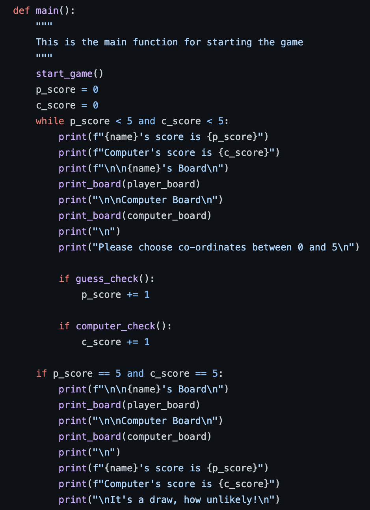
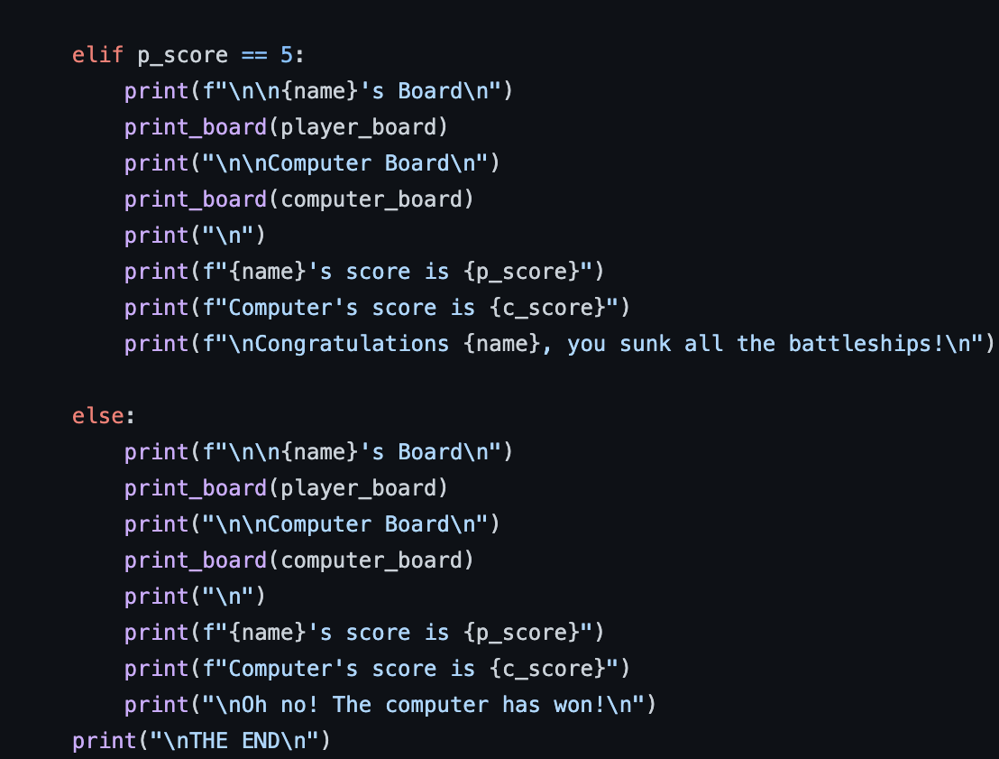

 
This if statement ensures that the main() function is the first function called.
 

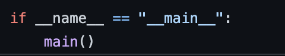

 

## Deployment

The site was deployed to the Heroku app through the following steps:
 

1. Ensure that any unnecessary imports (such as import pprint) are deleted before deployment
 

2. Ensure that any input methods used have a new line at the end of the text due to quirk in the software used to create the mock terminal
 

3. Ensure that any dependencies are added to the requirements.txt file using pip3 freeze > requirements.txt in the terminal. This will update the requirements.txt file
 

4. Create a free Heroku account. Heroku will ask for basic details such as name, email, and role (student)
 

5. Confirm your account by clicking on the confirmation link sent via email
 

6. Create your password and proceed
 

7. Accept terms of service
 

8. Create a new app for your project
 

9. Choose a unique name for your app (non-unique names are not allowed on Heroku)
 

10. Choose your location (USA or Europe) then create the app
 

11. Once the app has been created, click the settings tab in the upper right of the screen
 

12. Add a Config Var based on instructions from Code Institute
 

13. The value for key within Config Var is ‘PORT’ and the value for value is 8000
 

14. If you have used a file on your project that deals with sensitive information, make sure to add this as a Config Var as well. For example, a CREDS.json file would use CREDS as the value for key and the contents of the CREDS.json file as the value
 

15. Add these Config Vars to your app
 

16. Next step is to add two Buildpacks to your app
 

17. These Buildpacks are Python and nodejs. It is very important to ensure that they are in the order of the Python buildpack first, followed by the nodejs buildpack
 

18. Scroll to the top of the page and click the deploy section
 

19. Choose Github as the deployment method
 

20. Scroll down and confirm that we want to connect to Github
 

21. Search for repository name within Github. My project is named “battleships-game22”
 

22. Click the connect button to the right of the screen
 

23. Scroll down, ensure that you have selected the main (master) branch, and click on deploy branch under the Manual Deploy heading
 

24. This will allow you to see the deployment logs as it runs
 

25. Once this process has finished, there will be a message that confirms that the app has been successfully deployed
 

26. At the bottom of the screen, there will be a button to view the deployed project in the mock terminal
 

27. Click the button to view the project

 
 
The live link can be found here - 

## Credits
 

Code institute for the deployment terminal and general README structure

[Wikipedia](https://en.wikipedia.org/wiki/Battleship_(game)) for a general overview of Battleships and how to play

Part of my testing was done using [PythonTutor](https://pythontutor.com/visualize.html#mode=edit)

## Acknowledgements

A very big thank you to my mentor Daisy McGirr who gave me very helpful feedback and was very encouraging during our mentor sessions.

Also, a big thank you to the Slack community over the course of this entire module.