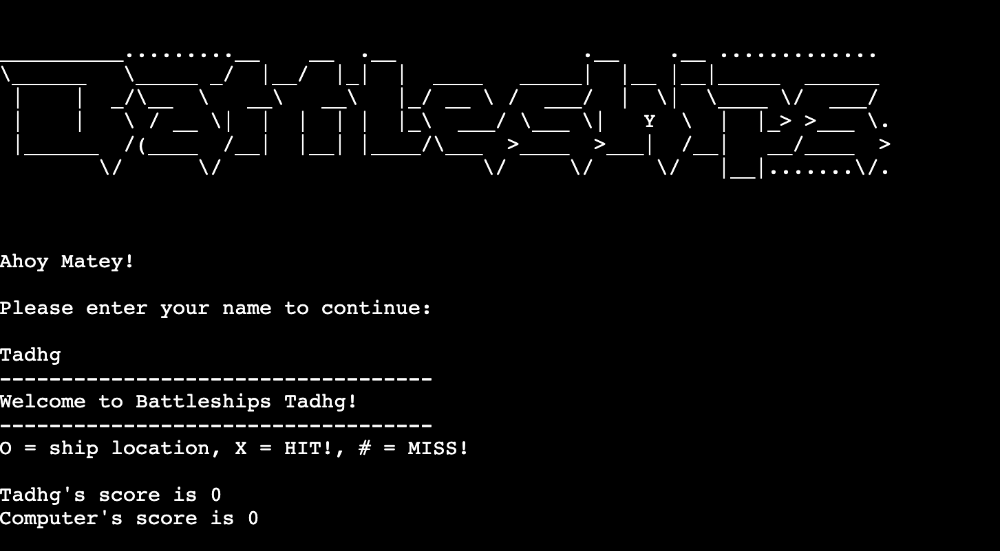
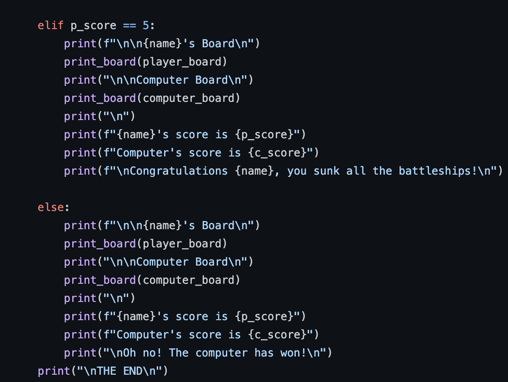

# Battleships Game
 
Battleships is a strategy guessing game that can be played against the computer or between two players. This version will be played against the computer
 
 
Battleships is accessible to, and can be enjoyable, for all age groups but requires a good strategy to be played well. Anyone who loves a challenege will enjoy this game
 
 

 
 

This is a welcoming opening for players of Battleships. It personalises the messages and board name depending on the name input provided. There is also error handling in case this field is left blank.

## How to play
 
This version of Battleships will be played on two 6x6 grids. One for the player and one for the computer

The aim of the game is to sink all of the opponent's battleships before they sink all of yours

At the start of the game you will be asked to input your name

Then, you will input your co-ordinates (row followed by column) and press enter to check if you have hit one of the computer's ships

This is an unforgiving game so make sure not to choose the same co-ordinates twice or the computer will get a free guess and you'll miss your turn!

Depending on the result, both your board and the computer's board will be updated with the position of your respective guesses

This will repeat until there is a winner!

## Features
 
This game features a computer board and a player board when printed and the player board is unique to the name input provided as opposed to being a generic board name. It makes for a more engaging game experience
 
 

 
 
Once the row and column have been validated, the results of that round of playing are shown. Here is an example of a miss for both player and computer
 
 

 
 
Here is an example of a player guess when the co-ordinates inputted have been previously selected. You will miss you turn if you make this mistake!
 
 

 
 
Through the use of try/except statements and while loops, there is comprehensive error handling for numbers outside the grid size as well as for non-numeric values
 
 

 
 
This is an example of a computer hit and a player miss. You'll have to try again. Better luck next time!
 
 

 
 
This time you got lucky! This is an example of a player hit!
 
 

 
 
Here we can see that that the player score and computer score is incremented and the board updated to reflect the score
 
 

 
 

 
 

 
 

### Main heading

 
 

 
 

 
 

### Main Game Section

 
 

 
 

 
 

 
 

 
 

### Features Left To Implement

Implement a feature to give the player the option of choosing the position of their ships instead of having them positioned at random

Add the option of choosing a player vs player setup where you can play against your friends instead of playing the computer

## Technologies

Python

[Github](https://github.com/) was used for version control to store commit history

[Heroku](https://www.heroku.com/home) was used to deploy our final project

## Testing
 

### Validator Testing

PYTHON: No errors were returned when passing through the official Pep8online linter

### Bugs

#### Solved Bugs
 

### Remaining Bugs
 

 

 
 

### Feature Function

Testing has been done using both [PythonTutor](https://pythontutor.com/visualize.html#mode=edit) and print() to verify and debug my code

This is the random module that has been imported for use in generating random numbers for board creation and computer guess

Testing create_board()

Testing print_board()

Testing welcome()

Testing ship_placement()

Testing guess_row()

Testing guess_col()

Testing guess_check()

Testing computer_guess()

Testing computer_check()

Testing start_game()

Testing main()

 
 
All functions within my run.py file have been tested throughout this project using print() and PythonTutor to ensure that each function executed as intended.
 
 
An example of testing done within PythonTutor to verify correct execution of my random number 'for' loop
 

 
 

## Deployment

The site was deployed to the Heroku app through the following steps:
 
 
1. Ensure that any unnecessary imports (such as import pprint) are deleted before deployment
 
 
2. Ensure that any input methods used have a new line (\n) at the end of the text due to quirk in the software used to create the mock terminal
 
 
3. Ensure that any dependencies are added to the requirements.txt file using pip3 freeze > requirements.txt in the terminal. This will update the requirements.txt file
 
 
4. Create a free Heroku account. Heroku will ask for basic details such as name, email, and role (student)
 
 
5. Confirm your account by clicking on the confirmation link sent via email
 
 
6. Create your password and proceed
 
 
7. Accept terms of service
 
 
8. Create a new app for your project
 
 
9. Choose a unique name for your app (non-unique names are not allowed on Heroku)
 
 
10. Choose your location (USA or Europe) then create the app
 
 
11. Once the app has been created, click the settings tab in the upper right of the screen
 
 
12. Add a Config Var based on instructions from Code Institute
 
 
13. The value for key within Config Var is ‘PORT’ and the value for value is 8000
 
 
14. If you have used a file on your project that deals with sensitive information, make sure to add this as a Config Var as well. For example, a CREDS.json file would use CREDS as the value for key and the contents of the CREDS.json file as the value
 
 
15. Add these Config Vars to your app
 
 
16. Next step is to add two Buildpacks to your app
 
 
17. These Buildpacks are Python and nodejs. It is very important to ensure that they are in the order of the Python buildpack first, followed by the nodejs buildpack
 
 
18. Scroll to the top of the page and click the deploy section
 
 
19. Choose Github as the deployment method
 
 
20. Scroll down and confirm that we want to connect to Github
 
 
21. Search for repository name within Github. My project is named “battleships-game22”
 
 
22. Click the connect button to the right of the screen
 
 
23. Scroll down, ensure that you have selected the main (master) branch, and click on deploy branch under the Manual Deploy heading
 
 
24. This will allow you to see the deployment logs as it runs
 
 
25. Once this process has finished, there will be a message that confirms that the app has been successfully deployed
 
 
26. At the bottom of the screen, there will be a button to view the deployed project in the mock terminal
 
 
27. Click the button to view the project

 
 
The live link can be found here - 

## Credits
 

Code institute for the deployment terminal and general README structure

[Wikipedia](https://en.wikipedia.org/wiki/Battleship_(game)) for a general overview of Battleships and how to play

Part of my testing was done using [PythonTutor](https://pythontutor.com/visualize.html#mode=edit)

## Acknowledgements

A very big thank you to my mentor who gave me very helpful feedback and was very encouraging during our mentor sessions.

Also, a big thank you to the Slack community over the course of this entire module.